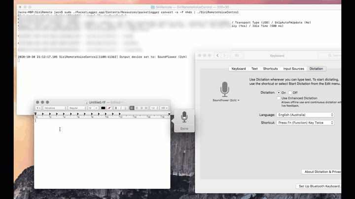

# Integrate Apple TV 4th Gen/Siri Remote with macOS for voice and touch control

This is the fruits of my work to integrate the Apple TV remote with macOS

If you have an apple tv 4th gen remote lying around that you have tried to pair
with your mac, you quickly realize you have to use external tools like SiriMote
to extend the functions of the remote on your system however SiriMote does not allow
you to use the mic function on the remote with your system and as far as 
I know no other tool allows you to do this.

This application is the second of the two whois purpose is to decode the voice packets
sent from the remote to audio that feeds into the input channel of your macOS, 
essentially allowing you to use the remote as mic input and coupled with voice control
functions of macOS can allow you to control your system.

One major hurdle to getting the voice data from the remote is having to use XCode Additional 
tools -> PacketLogger to capture the data as I could not find an easy way to get the bluetooth 
le data from the remote as the OS protects the hid uuid service. Short of having to write 
a kext driver or reverse engineer a private framework like Media Remote Protocol on macOS 
(https://medium.com/@evancoleman/apple-tv-meet-my-lights-dissecting-the-media-remote-protocol-d07d1909ad82)
there is no easy way to getting this data within a standalone application.

In this repository I have also included the application TrackMagic, created by
Nathan Vander Wiltand (https://github.com/calftrail/TrackMagic) and I have slightly modified 
it to connect to the SiriRemote. This application allows the use of the track pad on the
siri remote to control your mouse pointer.

To get these applications to work you will need to follow the below steps. 

Pre tasks:
Make sure you mac supports bluetooth le so your siri remote can pair with your mac

Tools you will need:

	a. Additional Tools for Xcode 10.1 or above (https://developer.apple.com/xcode/)
	b. SiriRemoteVoiceControl app from my github repository (https://github.com/Jack-R1/SiriRemoteVoiceControl/blob/master/Release/SiriRemoteVoiceControl.zip)
	
Steps:

1. Open System Preferences -> Bluetooth

2. Hold Volume Up & Menu on your remote

3. When you see your remote show up in Devices, click on connect
   
   Note if the remote fails to pair, turn bluetooth off for 30 seconds
   then turn back on and reattempt the previous step to put your remote in
   pairing mode, basically keep trying again until you pair with your mac

4. At this point your remote should be paired to your mac and when you press volume up or down 
   it should trigger volume control on your mac

5. Get the bluetooth mac address of your siri remote and note it to be used later in the steps.
   
   One way to do this is to hold option key and select Bluetooth in menu bar and it should
   show the devices and their mac address, e.g AA-BB-CC-DD-EE-FF, replace any dashes with 
   colons, AA-BB-CC-DD-EE-FF -> AA:BB:CC:DD:EE:FF
   
6. Create folder called SiriRemote on your desktop

7. Download Additional Tools for Xcode 10.1 or above
   
   Download the version supported by your macOS, 
   
   for High Sierra you can use 10.1,
   
   for Catalina you can use 11.4

8. Open the Additional Tools Package you have downloaded

9. Under Hardware folder, copy PacketLogger.app to SiriRemote folder you
   created on your desktop

10. Download and unzip SiriRemoteVoiceControl.zip from my GitHub repo 
	(https://github.com/Jack-R1/SiriRemoteVoiceControl/blob/master/Release/SiriRemoteVoiceControl.zip)
	
    or clone and build the project to produce output files.

11. Copy the contents of directory to SiriRemote folder you created on your desktop

12. Open terminal (Launchpad -> Other -> Terminal) 

13. Change directory to SiriRemote folder on your desktop
	
    cd ~/Desktop

14. Run the below command in terminal, replace AA:BB:CC:DD:EE:FF with the remote MAC address you obtained 
	in the earlier steps.
  
	  sudo ./PacketLogger.app/Contents/Resources/packetlogger convert -s -f nhdr | ./SiriRemoteVoiceControl AA:BB:CC:DD:EE:FF

    You will be prompted for your sudo password as xcode packetlogger needs to run in elevated privileges

    you can also do

    echo "password" | sudo -S ./PacketLogger.app/Contents/Resources/packetlogger convert -s -f nhdr | ./SiriRemoteVoiceControl AA:BB:CC:DD:EE:FF

    This will pipe your password to packet logger so you dont always have to type it in but I would not recommend to show your
    password in plain site. Note the -S after sudo.
    
    If you are prompted that SiriRemoteVoiceControl is written by an unidentified developer then
    you can either build the application in XCode or override the warning by going into
    System Preferences -> Security & Privacy -> Allow

15. Press volume up or down on your remote to make sure the remote is paired to your mac.
	
16. Now press and hold the mic button and speak in to the remote, it should indicate
	when voice data starts and ends on the console and you should hear your voice echo
	out of your mac.
	
	If it doesn't, try these options:
  
		a. press control + c, to terminate the command, and then press up and enter to run it again
    
		b. leaving the command still running, disconnect your siri remote from bluetooth in
		system preferences (just disconnect, dont unpair) and then reconnect

17. If you would like to proceed further to integrate the SiriRemote for voice control on 
	your mac then follow the below steps.
	
18. Download Soundflower (https://github.com/mattingalls/Soundflower/releases/tag/2.0b2)

19. Install Soundflower
	
	If installation fails to complete, go to System Preferences -> Security & Privacy
	and select Allow. Then rerun the installation package.

20. Open System Preferences -> Sound -> Input and set Soundflower (2ch) as input

21. Open System Preferences -> Keyboard -> Dictation

		a. Turn on Dictation if not already on.
		
		b. Set Soundflower (2ch) as input to the mic.
		
		c. Note the shortcut to trigger dictation.

22. In terminal, stop (Control-C) and rerun the command in step 14.

23. Press volume up or down on your remote to make sure the remote hasn't disconnected.
	
24. Open Notes app and have the cursor blinking ready for typing.

25. Trigger dictation (Press Fn/Function Key twice)

26. Now press and hold the mic button and speak in to the remote, what you speak into the
	mic will be dictated on the notes app.

27. If your running Catalina or Mojave you can have the remote open up Siri on your mac by 
	enabling Voice Control and speaking into the mic "Open Siri"
		
		System Preferences -> Accessibility -> Voice Control
	

	or if your running Sierra/High Sierra follow this article to enable "Hey Siri"
	
	https://www.macworld.com/article/3096187/how-to-make-siri-activate-when-you-say-hey-siri-to-your-mac-running-macos-sierra.html

28. Now that voice is integrated on your system, you can also integrate the siri remote trackpad
	by opening the TrackMagic.app that is included on your desktop folder.
	
	This app is slightly modified to work with the SiriRemote and was originally created 
	by Nathan Vander Wiltand (https://github.com/calftrail/TrackMagic)

29. You should be able to to move the mouse pointer from the siri remote trackpad, touch
	down (not press down) to select something and two fingers can allow you to scroll.
	
I have also a windows driver that I may finish working on and release if there is interest
to use the SiriRemote on windows system.

Happy hacking :)
